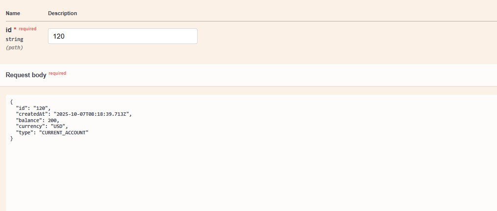
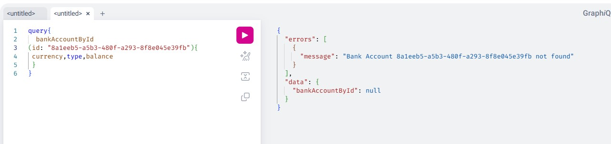

<h1>Connexion avec H2 database </h1>

<h1>Affichage de liste des comptes </h1>

<h1>Affichage du compte par id </h1>

<h1>Affichage des comptes avec pagination en utilisant Spring Data REST </h1>

<h1>Affichage des comptes par type en utilisant Spring Data REST</h1>

<h1>Affichage de liste des comptes avec swagger et Spring Data REST</h1>

<h1>Affichage d'un compte avec swagger et Spring Data REST</h1>

<h1>Ajout d'un compte avec swagger et Spring Data REST</h1>

<h1>Update d'un compte avec swagger et Spring Data REST</h1>

<h1>Suppression  d'un compte avec swagger et Spring Data REST</h1>

<h1>Affichage de liste des comptes avec swagger </h1>

<h1>Affichage d'un compte avec swagger </h1>

<h1>Ajout d'un compte avec swagger </h1>

<h1>Integration du postman avec swagger </h1>

<h1>Get avec postman </h1>

<h1>Get avec postman par id </h1>

<h1>Post avec postman  </h1>

<h1>put avec postman  </h1>

<h1>Affichage de liste des Customers </h1>

<h1>Affichage de liste des comptes avec graphql</h1>

<h1>Ajout d'un compte avec graphql</h1>

<h1>Ajout d'un compte avec graphql en utilisant les parametres</h1>

<h1>Update d'un compte avec graphql en utilisant les parametres</h1>

<h1>Delete d'un compte avec graphql </h1>

<h1>Affichage des customers avec graphql </h1>

<h1>Exemple de gestion d'exception </h1>

